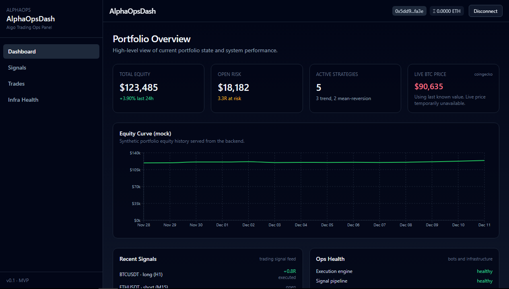

# AlphaOpsDash

AlphaOpsDash is an operational dashboard for algorithmic trading systems, focused on portfolio state, signal flow, and infrastructure health.

It is designed as a compact but realistic full-stack Web3-ready project:

- React + TypeScript + Tailwind on the frontend  
- Node.js + Express on the backend  
- Clean layered architecture (routes → controllers → services → connectors)  
- EVM wallet connectivity (Metamask, etc.)  
- Ready for future CEX/DEX or on-chain integrations  

---

## Screenshots



---

## Live Demo

- **Frontend (Vercel):** https://alpha-ops-dash.vercel.app  
- **Backend Health (Render):** https://alpha-ops-dash.onrender.com/api/health  

---

## Features

- Portfolio overview (equity, 24h PnL, open risk, strategies)  
- Equity history chart  
- Recent signals feed  
- Trades table (WIP)  
- Infra / ops health panel  
- Wallet connect button (EVM providers)  

Data is currently provided by an in-memory connector designed to be replaced by real exchange or chain modules.

---

## What This Project Demonstrates

- Full-stack TypeScript (frontend + backend)  
- Layered backend architecture with clear separation of concerns  
- Frontend consuming a typed API layer  
- Environment-based configuration (local vs production)  
- Automated tests on both sides (Vitest + Jest/Supertest)  
- Production deployment (frontend on Vercel, backend on Render)  

---

## Tech Stack

### Frontend

- React + TypeScript  
- Vite  
- Tailwind CSS  
- Recharts  
- Vitest + React Testing Library  

### Backend

- Node.js + Express  
- Layered architecture:
  - `routes/`
  - `controllers/`
  - `services/`
  - `connectors/`
  - `middleware/`
- Jest + Supertest  
- Structured logging middleware  

---

## Architecture Overview

```text
backend/
  src/
    config.js
    middleware/
      requestLogger.js
    connectors/
      mockExchangeConnector.js
    services/
      portfolioService.js
      signalService.js
      tradeService.js
      opsService.js
    controllers/
      portfolioController.js
      signalController.js
      tradeController.js
      opsController.js
    routes/
      portfolioRoutes.js
      signalRoutes.js
      tradeRoutes.js
      opsRoutes.js
    server.js

frontend/
  src/
    components/
      charts/PortfolioEquityChart.tsx
      layout/Sidebar.tsx
      layout/Topbar.tsx
    hooks/
      useWallet.ts
    pages/
      Dashboard.tsx
      Signals.tsx
      Infra.tsx
    services/
      mockApi.ts
    setupTests.ts
```

Running Locally
---------------

### Clone the repository

`git clone https://github.com/franklinzerocr/Alpha-Ops-Dash.git
cd Alpha-Ops-Dash`

* * * * *

### Backend

`cd backend
npm install

# development
npm run dev

# production-like
npm start`

The backend listens on `PORT` in `backend/.env` (default: `4000`).

* * * * *

### Frontend

`cd frontend
npm install

# development
npm run dev`

Vite runs at:

-   <http://localhost:5173>

* * * * *

Environment Variables
---------------------

### Backend (`backend/.env`)

`PORT=4000
CORS_ORIGIN=http://localhost:5173
LOG_LEVEL=info`

-   Render overrides `PORT` automatically.

-   In production, set `CORS_ORIGIN` to the deployed frontend URL.

### Frontend (`frontend/.env`)

`VITE_API_BASE=/api                      # local dev with Vite proxy
# VITE_API_BASE=https://alpha-ops-dash.onrender.com/api   # production`

In Vercel, `VITE_API_BASE` is configured as a project Environment Variable.

* * * * *

API Endpoints
-------------

| Method | Endpoint | Description |
| --- | --- | --- |
| GET | `/api/portfolio` | Portfolio summary |
| GET | `/api/portfolio/history` | Equity history |
| GET | `/api/signals` | Recent signals |
| GET | `/api/trades` | Executed trades (mock) |
| GET | `/api/ops` | Ops health |
| GET | `/api/health` | Simple health check |

Responses are currently provided by `connectors/mockExchangeConnector.js`.

* * * * *

Testing
-------

### Backend

`cd backend
npm test`

### Frontend

`cd frontend
npm test`

Tests are excluded from the production TypeScript build.

* * * * *

Deployment
----------

### Backend --- Render

-   Root: `/backend`

-   Build: `npm install`

-   Start: `npm start`

-   Env: `CORS_ORIGIN`, `LOG_LEVEL`, `PORT` (Render-managed)

### Frontend --- Vercel

-   Root: `/frontend`

-   Build: `npm run build`

-   Output: `dist`

-   Env: `VITE_API_BASE=https://alpha-ops-dash.onrender.com/api`